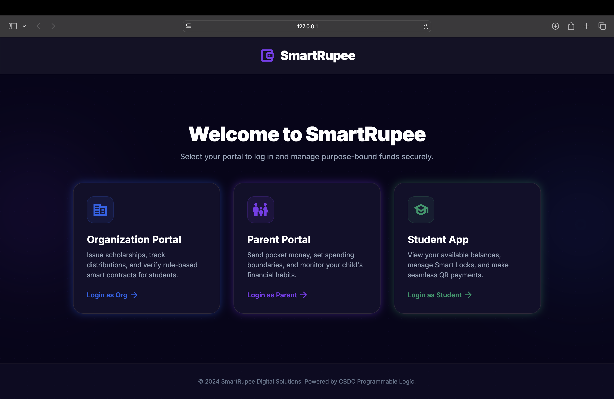
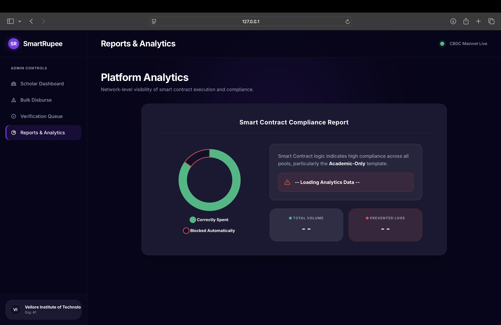
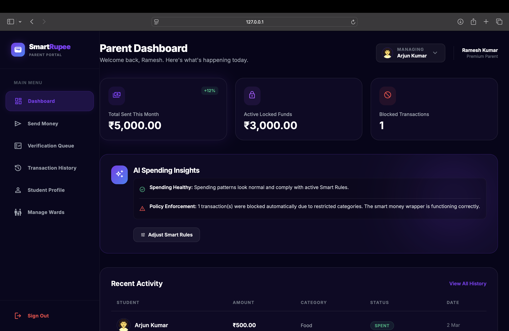
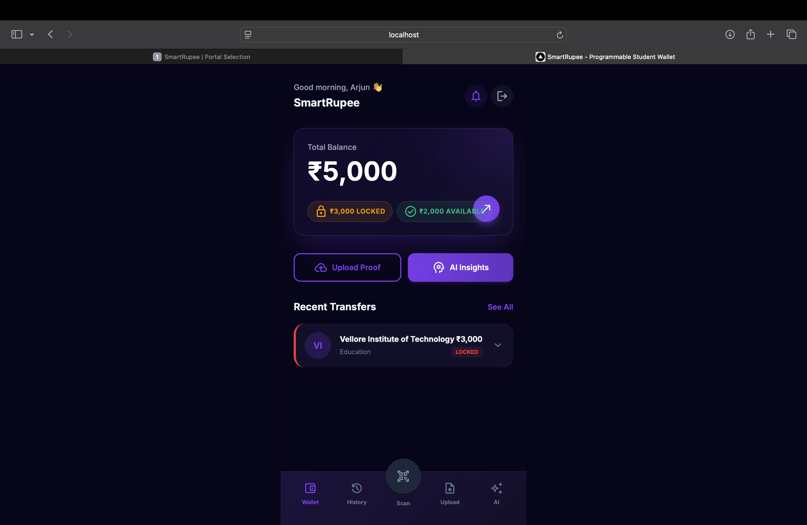

<div align="center">
  
</div>

# SmartRupee - Programmable Student Wallet 🎓💸

SmartRupee is an innovative digital wallet designed to empower students while providing transparency and control to parents and educational institutions. Built during the HackNDroid Hackathon, SmartRupee redefines how student allowances and institute funds are managed using purpose-bound, programmable money.

## 📸 Screenshots

| Student Dashboard | Parent Overview | Organization Analytics | Verification Queue |
| :---: | :---: | :---: | :---: |
|  |  |  |  |

_See the `photos/` directory for full-resolution images, including the `certificate.png`._

## 🚀 Features

- **Purpose-Bound Money:** Funds are categorized (e.g., Food, Books) and can only be spent at approved merchants.
- **Role-Based Portals:**
  - **Student Portal:** View balances, transaction history, scan QR to pay, and request funds.
  - **Parent Portal:** Send targeted allowances, track kid's spending, and set limits.
  - **Organization Portal:** Disburse bulk funds (scholarships, grants) and analyze ecosystem spending.
- **AI-Driven Analytics:** Built-in AI logic for automated anomaly detection and predictive spending insights.
- **Smart Verification:** Verification queue for high-value or restricted transactions.

## 🏗️ Project Architecture

This repository holds a full-stack monorepo with dedicated frontends for the three main personas, powered by a unified Python backend.

- `backend/` - The core FastAPI/Python server that handles authentication, database connections (`sqlite3`), and API endpoints for all portals.
- `frontend-student/` - React/Vite-based app for the student wallet interface.
- `frontend_parent/` - React/Vite-based app for parents to manage their wards' allowances.
- `frontend_organization/` - HTML/JS portal for institutions to handle bulk disbursements and analytics.
- `ai_logic/` - Python scripts for generating test data and running spending analytics.

## 🛠️ Tech Stack

- **Backend:** Python 3, FastAPI, SQLite
- **Frontend:** React, Vite, TailwindCSS, HTML/JS
- **Integrations:** Gemini AI (for analytics and insights)

## 💻 Getting Started

### Prerequisites

- Node.js (for React frontends)
- Python 3.8+ (for backend)

### Backend Setup

```bash
cd backend
python -m venv venv
source venv/bin/activate  # Or `venv\Scripts\activate` on Windows
pip install -r requirements.txt
python main.py
```
*The backend server will start on `http://localhost:8000`.*

### Frontend Setup (Example: Student Portal)

```bash
cd frontend-student
npm install
npm run dev
```

### Environment Variables

Each subsystem has its own `.env.example`. Copy these to `.env` and configure accordingly (e.g., set your `GEMINI_API_KEY`).

## ✨ Contributors

Built with ❤️ for the HackNDroid Hackathon.
